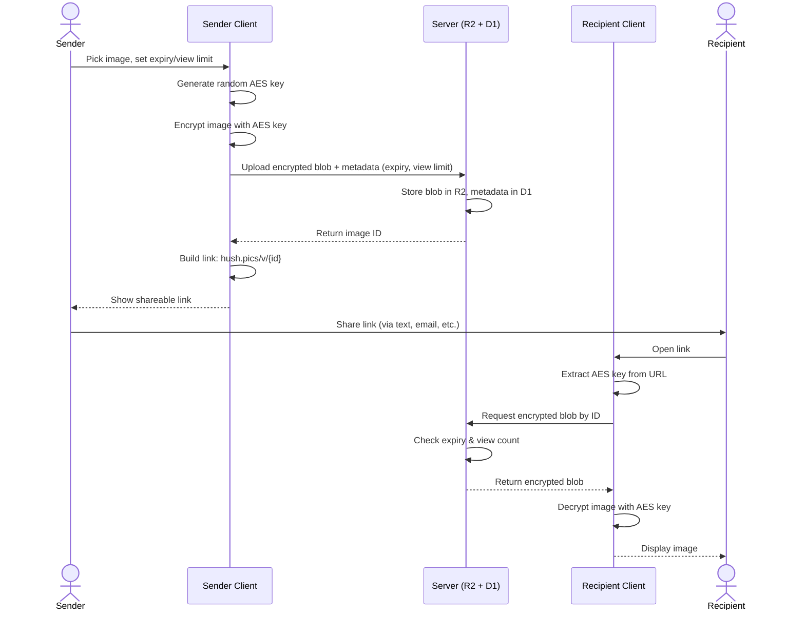
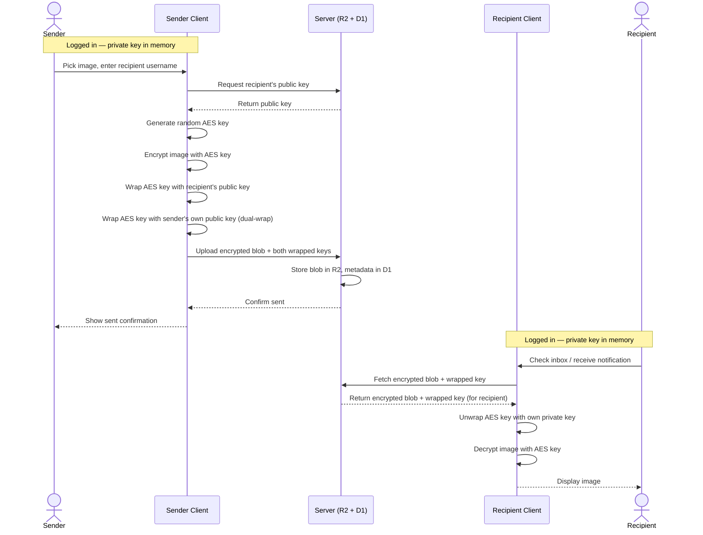
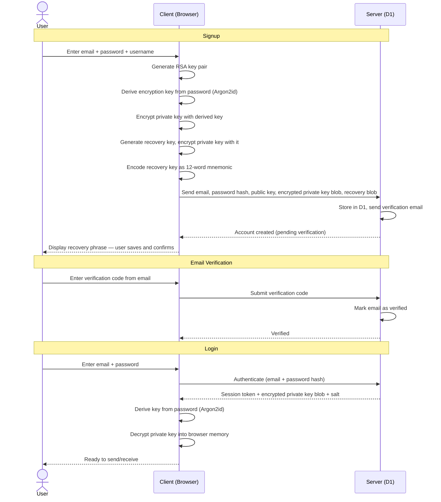
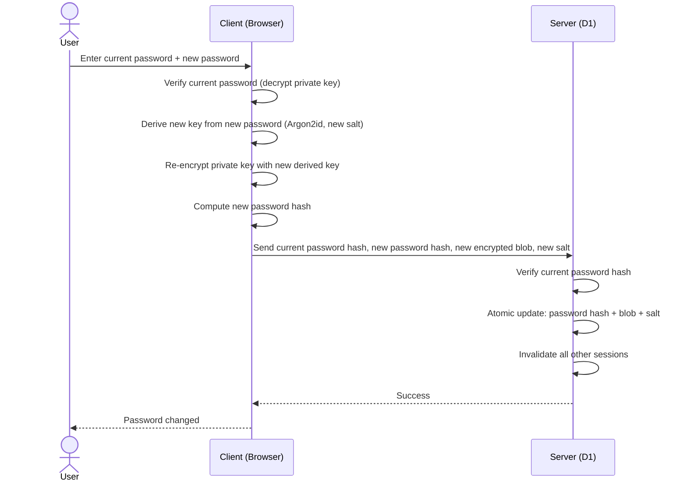
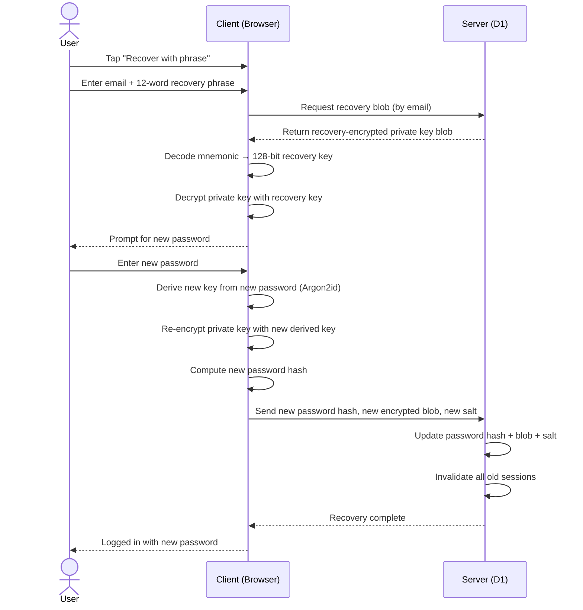

# Architecture — Hush

> Technical source of truth for how Hush is built. For product behavior and UX, see [product-spec.md](product-spec.md). For wireframes, see [app-wireframes.md](app-wireframes.md).

---

## Table of Contents

1. [System Overview](#1-system-overview)
2. [Cryptographic Architecture](#2-cryptographic-architecture)
3. [Client-Side Encryption/Decryption Flows](#3-client-side-encryptiondecryption-flows)
4. [API Design](#4-api-design)
5. [Storage Architecture](#5-storage-architecture)
6. [Authentication & Key Management](#6-authentication--key-management)
7. [PWA Technical Considerations](#7-pwa-technical-considerations)
8. [Rate Limiting & Abuse Prevention](#8-rate-limiting--abuse-prevention)
9. [Appendix: Sequence Diagrams](#9-appendix-sequence-diagrams)

---

## 1. System Overview

```
┌──────────────┐       HTTPS        ┌─────────────────────────┐
│              │ ─────────────────> │  Cloudflare Workers     │
│   Client     │                    │  (Hono API)             │
│   (PWA)      │ <────────────────  │                         │
│              │                    │  ┌───────┐  ┌────────┐  │
│  Web Crypto  │                    │  │  D1   │  │   R2   │  │
│  AES-256-GCM │                    │  │(meta) │  │(blobs) │  │
│  RSA-OAEP    │                    │  └───────┘  └────────┘  │
│  Argon2id    │                    └─────────────────────────┘
└──────────────┘
```

**Zero-knowledge property:** The server only stores encrypted blobs and metadata. It never receives decryption keys — in link mode the key stays in the URL fragment (never sent to the server), and in account mode the key is wrapped with the recipient's public key. A full database breach yields only ciphertext.

| Layer        | Technology                                        |
| ------------ | ------------------------------------------------- |
| Frontend     | TanStack Start (React), PWA, shared responsive UI |
| API          | Hono on Cloudflare Workers                        |
| Blob storage | Cloudflare R2                                     |
| Metadata DB  | Cloudflare D1                                     |
| Encryption   | Web Crypto API                                    |
| Validation   | Zod (shared client/server schemas)                |
| Language     | TypeScript everywhere                             |
| Client       | Open source                                       |

---

## 2. Cryptographic Architecture

### 2.1 Primitives

| Purpose                        | Algorithm             | Parameters                                                                      |
| ------------------------------ | --------------------- | ------------------------------------------------------------------------------- |
| Image encryption               | AES-256-GCM           | 256-bit key, 96-bit IV, 128-bit auth tag                                        |
| Key wrapping (account mode)    | RSA-OAEP with SHA-256 | 2048-bit key pair                                                               |
| Password-based key derivation  | Argon2id (WASM)       | Memory: 64 MB, iterations: 3, parallelism: 1 (tuned for 1–2s on target devices) |
| Password hashing (server auth) | Argon2id              | Server-side, separate salt and parameters from client-side KDF                  |
| Recovery key encoding          | BIP-39 mnemonic       | 12 words encoding 128-bit key                                                   |
| Session tokens                 | Random 256-bit        | Server-stored, 30-day sliding expiry                                            |

### 2.2 Encrypted Payload Format

The client doesn't encrypt raw image bytes. It encrypts a structured payload that bundles the image with metadata the server should never see:

```json
{
  "version": 1,
  "image": "<raw image bytes>",
  "mimeType": "image/png",
  "senderName": "@jane",
  "caption": null
}
```

- Serialized as JSON (future: evaluate MessagePack/CBOR for compactness)
- Encrypted as a single AES-256-GCM blob
- `version` field allows future format evolution without breaking old payloads
- `senderName` is optional — `null` for anonymous senders
- `caption` is reserved for future use
- After decryption, the recipient's client unpacks and renders both the image and the embedded metadata

### 2.3 IV/Nonce Management

- Fresh random 96-bit IV per encryption operation via `crypto.getRandomValues()`
- IV is prepended to ciphertext: stored format is `IV (12 bytes) || ciphertext || auth tag`
- IV is not secret but must never be reused with the same key

### 2.4 Key Generation

- **Link mode:** `crypto.getRandomValues()` for 256-bit AES key
- **Account mode key pair:** `crypto.subtle.generateKey("RSA-OAEP", ...)` for 2048-bit RSA key pair, generated once at signup
- **Recovery key:** `crypto.getRandomValues()` for 128-bit key, encoded as BIP-39 mnemonic

---

## 3. Client-Side Encryption/Decryption Flows

### 3.1 Link Sharing — Encryption

1. Read image file into `ArrayBuffer`
2. Validate file type (JPEG, PNG, WebP, GIF) and size (5 MB free / 50 MB pro)
3. Construct payload object: `{ version: 1, image, mimeType, senderName, caption }`
4. Serialize payload to bytes (JSON → `TextEncoder`)
5. Generate random AES-256-GCM key: `crypto.subtle.generateKey({ name: "AES-GCM", length: 256 }, true, ["encrypt"])`
6. Generate random 96-bit IV: `crypto.getRandomValues(new Uint8Array(12))`
7. Encrypt: `crypto.subtle.encrypt({ name: "AES-GCM", iv }, key, serializedPayload)`
8. Prepend IV to ciphertext
9. Upload `IV || ciphertext` to server via `POST /api/blobs`
10. Export key to raw bytes: `crypto.subtle.exportKey("raw", key)`
11. Base64url-encode the key
12. Construct URL: `hush.pics/v/{blobId}#{base64urlKey}`

### 3.2 Link Sharing — Decryption

1. Parse URL — extract blob ID from path and key from `#fragment` (fragment is never sent to server)
2. Fetch encrypted blob: `GET /api/blobs/{id}`
3. Split IV (first 12 bytes) from ciphertext
4. Import key: `crypto.subtle.importKey("raw", base64urlDecode(fragment), "AES-GCM", false, ["decrypt"])`
5. Decrypt: `crypto.subtle.decrypt({ name: "AES-GCM", iv }, key, ciphertext)`
6. Deserialize payload (JSON parse)
7. Render image with `mimeType`, display `senderName` if present

### 3.3 Account-to-Account — Encryption

1. Fetch recipient's public key: `GET /api/users/{username}/public-key`
2. Import recipient's public key: `crypto.subtle.importKey("spki", ...)`
3. Import sender's own public key (already in memory from login)
4. Generate random AES-256-GCM key
5. Encrypt image payload with AES key (same as link mode steps 3–8)
6. Wrap AES key for recipient: `crypto.subtle.wrapKey("raw", aesKey, recipientPublicKey, "RSA-OAEP")`
7. Wrap AES key for sender (dual-wrap): `crypto.subtle.wrapKey("raw", aesKey, senderPublicKey, "RSA-OAEP")`
8. Upload: `IV || ciphertext` + `wrappedKeyRecipient` + `wrappedKeySender` via `POST /api/blobs`

The dual-wrap (step 7) allows the sender to re-view their own sent images from the dashboard. It adds ~256 bytes per image and leaks no additional metadata — the server already knows sender and recipient in account mode.

### 3.4 Account-to-Account — Decryption

1. Fetch blob + wrapped key: `GET /api/blobs/{id}` (server returns the appropriate wrapped key based on whether the requester is the sender or recipient)
2. Unwrap AES key: `crypto.subtle.unwrapKey("raw", wrappedKey, ownPrivateKey, "RSA-OAEP", "AES-GCM", false, ["decrypt"])`
3. Split IV from ciphertext
4. Decrypt: `crypto.subtle.decrypt({ name: "AES-GCM", iv }, aesKey, ciphertext)`
5. Deserialize and render

---

## 4. API Design

### 4.1 Endpoints

#### Public (no auth required)

| Method | Path                              | Description                                               |
| ------ | --------------------------------- | --------------------------------------------------------- |
| `POST` | `/api/blobs`                      | Upload encrypted blob (anonymous link share)              |
| `GET`  | `/api/blobs/:id`                  | Fetch encrypted blob (checks expiry + view count)         |
| `POST` | `/api/auth/signup`                | Create account                                            |
| `POST` | `/api/auth/login`                 | Authenticate → session token + encrypted private key blob |
| `POST` | `/api/auth/verify-email`          | Verify email with code                                    |
| `POST` | `/api/auth/recover`               | Account recovery via recovery phrase                      |
| `GET`  | `/api/users/:username/public-key` | Fetch public key for account-to-account encryption        |
| `POST` | `/api/reports`                    | Submit abuse report (metadata only)                       |

#### Authenticated (Bearer token)

| Method   | Path                         | Description                                                                   |
| -------- | ---------------------------- | ----------------------------------------------------------------------------- |
| `POST`   | `/api/blobs`                 | Upload encrypted blob (associated with sender account)                        |
| `GET`    | `/api/inbox`                 | List received items (metadata only — blob IDs, timestamps, expiry, sender ID) |
| `GET`    | `/api/sent`                  | List sent items (metadata only)                                               |
| `DELETE` | `/api/blobs/:id`             | Delete a blob (sender only)                                                   |
| `POST`   | `/api/blobs/:id/revoke`      | Revoke access to a blob (sender only)                                         |
| `GET`    | `/api/sessions`              | List active sessions                                                          |
| `DELETE` | `/api/sessions/:id`          | Terminate a session                                                           |
| `PUT`    | `/api/account/password`      | Change password (re-encrypt private key blob)                                 |
| `PUT`    | `/api/account/username`      | Change username                                                               |
| `DELETE` | `/api/account`               | Delete account                                                                |
| `POST`   | `/api/users/:username/block` | Block a user                                                                  |
| `DELETE` | `/api/users/:username/block` | Unblock a user                                                                |

### 4.2 Authentication

- Session token in `Authorization: Bearer <token>` header
- Tokens are opaque random strings, hashed and stored server-side in D1
- 30-day sliding expiry — refreshed on activity
- Login returns the session token + encrypted private key blob

### 4.3 Request/Response Conventions

- JSON request and response bodies
- Zod schemas shared between client and server for validation
- Standard error envelope:

```json
{
  "error": {
    "code": "BLOB_EXPIRED",
    "message": "This image has expired."
  }
}
```

- HTTP status codes: `200` success, `201` created, `400` bad request, `401` unauthorized, `404` not found, `410` gone (expired/revoked), `429` rate limited, `451` restricted (abuse report threshold)

---

## 5. Storage Architecture

### 5.1 Cloudflare R2 (Blob Storage)

- Each encrypted blob stored as a single R2 object
- Object key: UUID v4 (the blob ID)
- Content type: always `application/octet-stream` — server is type-agnostic
- Max object size: 5 MB (free) / 50 MB (pro) — enforced at API layer via `Content-Length` check before accepting upload body

### 5.2 Cloudflare D1 (Metadata Database)

#### Conceptual Schema

**users**

| Column                           | Type      | Notes                                           |
| -------------------------------- | --------- | ----------------------------------------------- |
| `id`                             | UUID      | Primary key                                     |
| `email`                          | TEXT      | Unique                                          |
| `email_verified`                 | BOOLEAN   | Must be true for account-to-account sending     |
| `username`                       | TEXT      | Unique                                          |
| `password_hash`                  | TEXT      | Argon2id hash (server-side)                     |
| `public_key`                     | BLOB      | Raw public key bytes (shared openly)            |
| `encrypted_private_key`          | BLOB      | Private key encrypted with password-derived key |
| `encrypted_private_key_salt`     | BLOB      | Salt for Argon2id derivation                    |
| `recovery_encrypted_private_key` | BLOB      | Private key encrypted with recovery key         |
| `created_at`                     | TIMESTAMP |                                                 |
| `deleted_at`                     | TIMESTAMP | Nullable — soft delete for 30-day grace period  |

**blobs**

| Column                  | Type      | Notes                                                         |
| ----------------------- | --------- | ------------------------------------------------------------- |
| `id`                    | UUID      | Primary key, matches R2 object key                            |
| `sender_id`             | UUID      | FK → users, nullable (anonymous link shares)                  |
| `recipient_id`          | UUID      | FK → users, nullable (link shares have no specific recipient) |
| `wrapped_key_recipient` | BLOB      | Nullable (only for account-to-account)                        |
| `wrapped_key_sender`    | BLOB      | Nullable (only for account-to-account, dual-wrap)             |
| `expires_at`            | TIMESTAMP | Nullable (persistent shares)                                  |
| `max_views`             | INTEGER   | Nullable (unlimited)                                          |
| `view_count`            | INTEGER   | Default 0                                                     |
| `revoked`               | BOOLEAN   | Default false                                                 |
| `created_at`            | TIMESTAMP |                                                               |

**sessions**

| Column        | Type      | Notes                                            |
| ------------- | --------- | ------------------------------------------------ |
| `id`          | UUID      | Primary key                                      |
| `user_id`     | UUID      | FK → users                                       |
| `token_hash`  | TEXT      | Hashed session token                             |
| `device_info` | TEXT      | User-agent summary (for display in session list) |
| `ip_address`  | TEXT      | For display in session list                      |
| `last_active` | TIMESTAMP |                                                  |
| `created_at`  | TIMESTAMP |                                                  |

**blocks**

| Column       | Type      | Notes                                    |
| ------------ | --------- | ---------------------------------------- |
| `blocker_id` | UUID      | FK → users                               |
| `blocked_id` | UUID      | FK → users                               |
| `created_at` | TIMESTAMP |                                          |
|              |           | Composite PK: `(blocker_id, blocked_id)` |

**reports**

| Column        | Type      | Notes                                              |
| ------------- | --------- | -------------------------------------------------- |
| `id`          | UUID      | Primary key                                        |
| `reporter_id` | UUID      | FK → users, nullable (anonymous reporters)         |
| `blob_id`     | UUID      | FK → blobs                                         |
| `reason`      | TEXT      | Category: `illegal`, `harassment`, `spam`, `other` |
| `created_at`  | TIMESTAMP |                                                    |

### 5.3 Blob Lifecycle & Cleanup

- **Expiry enforcement:** API checks `expires_at` and `view_count >= max_views` on every fetch request. Expired or exhausted blobs return `410 Gone`.
- **View-once:** On successful fetch, atomically increment `view_count`. If `max_views = 1`, the blob is immediately eligible for cleanup.
- **Revocation:** Sets `revoked = true`. Fetch requests immediately return `410`.
- **R2 cleanup job:** Scheduled Cloudflare Worker (cron trigger, every 15 minutes):
  1. Query D1 for blobs where `expires_at < NOW()` or `view_count >= max_views` or `revoked = true`
  2. Delete corresponding R2 objects
  3. Delete blob metadata rows
- **Blob without key is useless:** Even if an expired blob hasn't been purged yet, it's just encrypted noise without the decryption key.

### 5.4 Server Metadata Per Sharing Mode

This table clarifies exactly what the server knows in each mode. This addresses a subtlety in the product spec: the received tab shows "From: @jane" which comes from the decrypted payload, but the server also knows the sender's identity in account-to-account mode via `sender_id`.

|                          | Link (anonymous)                     | Link (logged-in sender)          | Account-to-Account               |
| ------------------------ | ------------------------------------ | -------------------------------- | -------------------------------- |
| Server knows sender?     | No                                   | Yes (`sender_id`)                | Yes (`sender_id`)                |
| Server knows recipient?  | No                                   | No                               | Yes (`recipient_id`)             |
| Wrapped keys stored?     | No (key in URL fragment)             | No                               | Yes (recipient + sender)         |
| Sender name in UI        | From decrypted payload (if included) | From decrypted payload           | From decrypted payload           |
| Server can infer sender? | No                                   | Yes (has `sender_id` → username) | Yes (has `sender_id` → username) |

**Design decision:** The UI always sources the sender name from the decrypted payload for consistency. However, for the received inbox list (before decryption), the server provides `sender_id` so the client can display "From: @jane" using a username lookup. This is honest metadata — the server already knows who sent to whom in account mode. The product spec's "What the Server Knows" table reflects this.

---

## 6. Authentication & Key Management

### 6.1 Signup Flow

1. Client collects email, password, username
2. Client generates RSA-OAEP 2048-bit key pair: `crypto.subtle.generateKey("RSA-OAEP", true, ["wrapKey", "unwrapKey"])`
3. Client exports private key: `crypto.subtle.exportKey("pkcs8", privateKey)`
4. Client derives encryption key from password: `argon2id(password, randomSalt, { memory: 64MB, iterations: 3, parallelism: 1 })` → 256-bit derived key
5. Client encrypts private key with derived key: `AES-GCM(derivedKey, privateKeyBytes)` → `encryptedPrivateKey`
6. Client generates 128-bit recovery key: `crypto.getRandomValues(new Uint8Array(16))`
7. Client encrypts private key with recovery key: `AES-GCM(recoveryKey, privateKeyBytes)` → `recoveryEncryptedPrivateKey`
8. Client encodes recovery key as 12-word BIP-39 mnemonic
9. Client hashes password for server auth (separate Argon2id invocation with different salt, or sends to server for server-side hashing)
10. Client sends to server: `{ email, passwordHash, publicKey, encryptedPrivateKey, salt, recoveryEncryptedPrivateKey }`
11. Server stores in D1, sends email verification code
12. Client displays recovery phrase — user confirms by entering 2 random words
13. Account created (pending email verification)

### 6.2 Login Flow

1. Client sends `{ email, passwordHash }`
2. Server verifies password hash, issues session token
3. Server returns: `{ sessionToken, encryptedPrivateKey, salt }`
4. Client re-derives key from password: `argon2id(password, salt, params)` → derived key
5. Client decrypts private key: `AES-GCM.decrypt(derivedKey, encryptedPrivateKey)` → private key in memory
6. Private key available in browser memory for the session duration

The user experiences this as a single step: enter password, wait for "Decrypting your keys..." progress bar, done.

### 6.3 Password Change Flow

This is a critical atomic operation. The private key blob must be re-encrypted with the new password-derived key.

**Steps:**

1. User enters current password + new password
2. Client verifies current password by attempting to decrypt the private key blob (should already be in memory from login, but verify to prevent stale-session edge cases)
3. Client derives new encryption key: `argon2id(newPassword, newSalt, params)` → new derived key
4. Client re-encrypts private key: `AES-GCM(newDerivedKey, privateKeyBytes)` → new encrypted private key blob
5. Client computes new password hash for server auth
6. Client sends to server: `{ currentPasswordHash, newPasswordHash, newEncryptedPrivateKey, newSalt }`
7. Server verifies current password hash
8. Server atomically updates in a single D1 transaction: password hash + encrypted private key blob + salt
9. Server invalidates all other sessions (force re-login on other devices)
10. Server returns success

**Failure handling:**

- **Server update fails** (D1 transaction failure): Client retries. Old password + old encrypted blob remain valid. No data loss.
- **Client crashes after encrypting, before uploading**: Same — old credentials remain valid.
- **Race condition** (password changed on two devices simultaneously): The server's atomic transaction ensures only one succeeds. The other gets a conflict error and must re-authenticate with the (now current) password.
- **Key point:** The private key itself never changes — only its encrypted wrapper. No risk of "encrypting with the wrong key."

### 6.4 Recovery Phrase Mechanism

The recovery phrase provides a second path to decrypt the private key, independent of the password.

**What it encodes:**

- The recovery phrase is a BIP-39-style mnemonic (12 words from a 2048-word list) encoding a 128-bit recovery key
- This recovery key is a **separate symmetric key** — not the private key itself, and not derived from the password
- The server stores a second encrypted copy of the private key, encrypted with this recovery key

**How recovery works:**

1. User taps "Recover with phrase" on the login screen
2. User enters email + 12-word recovery phrase
3. Client sends email to server (for account lookup, NOT the recovery phrase)
4. Server returns `recoveryEncryptedPrivateKey` blob
5. Client decodes mnemonic → 128-bit recovery key
6. Client decrypts private key with recovery key
7. Client prompts user to set a new password
8. Client re-encrypts private key with new password-derived key
9. Client sends new password hash + new encrypted private key blob to server
10. Server updates, invalidates all old sessions
11. User is logged in with new password

**Security implications:**

- The recovery phrase is as powerful as the password — anyone with it + the email can take over the account
- The server stores two encrypted copies of the private key (password-derived and recovery-derived). Both are useless without their respective keys.
- Recovery phrase cannot be regenerated or changed. If lost, the user must rely on their password. If both are lost, the account is unrecoverable. That's the point.

### 6.5 Key Lifecycle

- One key pair per account, persistent forever
- Same key pair works across every device — logging in on a new device re-derives and decrypts
- No key rotation (conscious trade-off — rotation would require re-encrypting all wrapped keys for existing images)

---

## 7. PWA Technical Considerations

### 7.1 Service Worker

- Cache shell assets (HTML, CSS, JS) for fast app shell loading
- Do **not** cache encrypted blobs — view-once images would be defeatable via cache, and caching large blobs wastes storage
- Handle Web Push registration and display

### 7.2 Web Push

- Use Push API + Notification API where browser supports it
- Registration: client subscribes, sends push subscription endpoint to server
- Server sends generic notifications only: `{ title: "Hush", body: "You have a new image" }` — no sender name, no preview, minimal metadata
- Opt-in only — users must explicitly enable push notifications

### 7.3 iOS Limitations

- Web Push requires iOS 16.4+ and the PWA must be added to home screen
- No badge API support on iOS
- Service Worker behavior is more restricted in Safari
- `crypto.subtle` is fully supported in Safari 15+
- Argon2id WASM should be tested on iOS Safari for performance

### 7.4 Installability

- Web app manifest: icons, theme color, `display: standalone`
- Install prompt handling for Chrome/Edge
- "Add to Home Screen" guidance for iOS Safari users

### 7.5 Memory Constraints

- Client-side encryption requires holding the entire file in memory as `ArrayBuffer`
- 5 MB (free tier) is safe on all devices
- 50 MB (pro tier) should be tested on low-memory mobile devices
- Future consideration: streaming encryption via `ReadableStream` + `TransformStream` if Web Crypto API adds streaming support

---

## 8. Rate Limiting & Abuse Prevention

### 8.1 API Rate Limits

| Endpoint Category | Anonymous (IP-based) | Free Tier (account-based) | Pro Tier     |
| ----------------- | -------------------- | ------------------------- | ------------ |
| Blob upload       | 5/hour               | 20/hour                   | 100/hour     |
| Blob fetch        | 60/min               | 120/min                   | 300/min      |
| Login attempts    | 5/min per IP         | 5/min per IP              | 5/min per IP |
| Signup            | 3/hour per IP        | N/A                       | N/A          |
| Username lookup   | 30/min               | 60/min                    | 120/min      |

### 8.2 Implementation

- Cloudflare Workers rate limiting (built-in sliding window)
- IP-based for anonymous requests
- Account-based for authenticated requests (fall back to IP if token is invalid)
- Return `429 Too Many Requests` with `Retry-After` header

### 8.3 Upload Constraints

- Max file size: enforced at API layer via `Content-Length` header check before accepting body
- Concurrent upload limit: 1 active upload per session (prevents parallel abuse)
- Total storage quota per account (TBD: e.g., 100 MB free, 1 GB pro)

### 8.4 Abuse Prevention

- **Block list enforcement:** Server rejects blob creation where `sender_id` is blocked by `recipient_id`
- **Report thresholds:** N reports against a blob → auto-restrict (fetch returns `451`). N reports against an account → auto-suspend sending capability.
- **IP reputation:** Leverage Cloudflare's bot detection and threat score
- **Abuse escalation ladder:** Warning → temporary send restriction → account suspension. Suspended accounts retain their public key (existing recipients can still decrypt) but cannot send.

---

## 9. Appendix: Sequence Diagrams

### 9.1 Link Sharing Flow



### 9.2 Account-to-Account Flow



### 9.3 Signup & Login Flow



### 9.4 Password Change Flow



### 9.5 Account Recovery Flow


