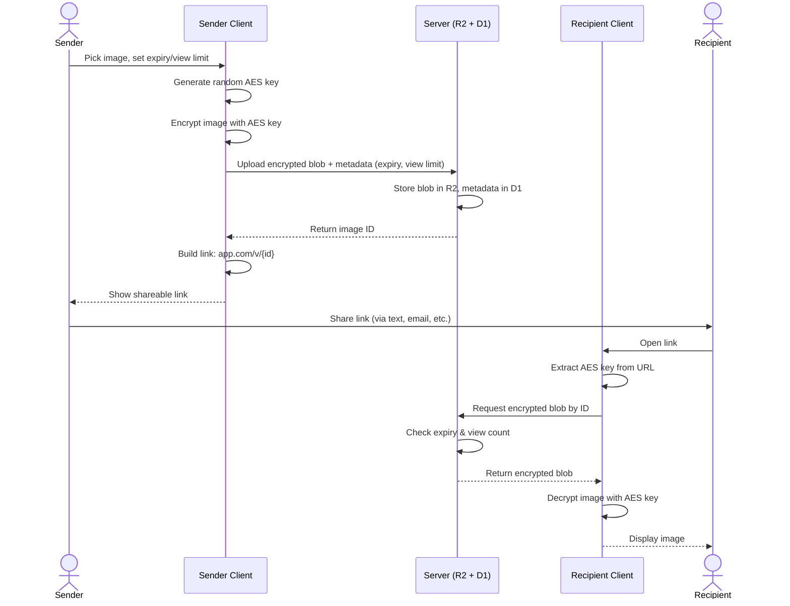
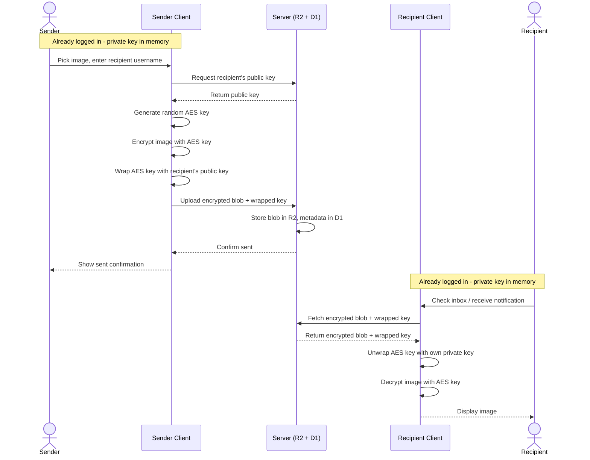
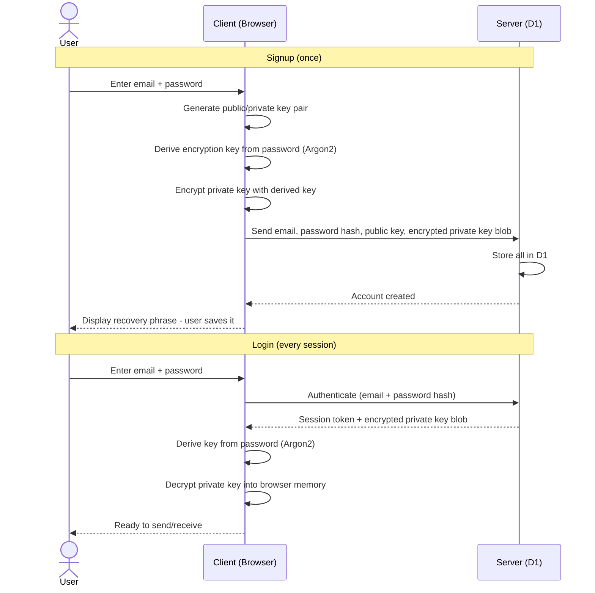

# Product Spec - Encrypted Image Sharing App

## What Is This?

A fast, fun, privacy-first image sharing app where encryption is built into the architecture - not a policy promise. The server never sees your images. Ever.

**One-liner:** "Send images that nobody can see but your recipient - not us, not hackers, not anyone."

---

## Core Principles

- **Zero-knowledge by design.** The server only stores encrypted blobs. A full database breach yields nothing usable.
- **Provable, not promised.** Open-source client. Users (and auditors) can verify the privacy claims.
- **Fun and fast.** Privacy shouldn't feel like a chore. The UX should feel closer to Snapchat than to a security tool.
- **In and out.** No infinite scroll, no algorithmic feed. Send, view, done.

---

## How It Works

There are two ways to send images. Both use client-side encryption. Neither requires the server to see the image.

### Mode 1: Link Sharing (no account needed)

Anyone can use the app without signing up. This is the entry point and the viral loop.

1. User picks an image, sets expiration and view limit (view once, 24h, 7d)
2. Browser generates a random AES key and encrypts the image on-device
3. Encrypted blob uploads to server
4. User gets a shareable link: `app.com/v/abc123#decryptionKey`
5. The `#fragment` (decryption key) never reaches the server - it stays client-side only
6. Anyone with the link can view the image. No account needed to send or receive.

**Logged-in users can also send via link.** Same flow, but the image is associated with their account so they can manage it (revoke, check view count, delete) from their dashboard.

### Mode 2: Account-to-Account Sharing (both users signed in)

For direct sharing between users who know each other's usernames.

1. Sender looks up recipient's username
2. App fetches recipient's public key from the server
3. Browser generates a random AES key, encrypts the image with it
4. Browser wraps the AES key with the recipient's public key
5. Uploads: encrypted blob + wrapped key
6. Recipient's app unwraps the AES key using their private key and decrypts on-device

The sender never shares a link or fragment. The recipient's key pair handles access.

### Encrypted Payload Format

The client doesn't encrypt raw image bytes. It encrypts a structured payload that bundles the image with metadata the server should never see:

```
{
  image:       <raw image bytes>,
  mimeType:    "image/png",
  senderName:  "@jane",       // optional, null if anonymous
  caption:     "..."          // reserved for future use
}
```

This is serialized and encrypted as one blob. After decryption, the recipient's client unpacks it and displays both the image and the embedded metadata. The server only ever sees the outer ciphertext - it has no idea what's inside.

### Viewing

- **Via link:** Open the link → browser reads the decryption key from the `#fragment` → fetches encrypted blob → decrypts → displays. No account needed.
- **Via account:** Log in → notification or inbox → app fetches blob + wrapped key → unwraps with private key → decrypts → displays.

### Flow Diagrams

#### Link Sharing (no account needed)



#### Account-to-Account Sharing



#### Account Signup & Login



---

## User-Controlled Lifecycle

The sender chooses how long content lives. This isn't Snapchat deciding for you. These controls are available in both link and account-to-account sharing.

| Option             | Behavior                                                                    |
| ------------------ | --------------------------------------------------------------------------- |
| **View once**      | Image key discarded after first view; server deletes blob                   |
| **Time-limited**   | Expires after 24h or 7d                                                     |
| **Persistent**     | Stays until sender deletes it (account-to-account only)                     |
| **Revoke anytime** | Sender can kill access instantly regardless of the above (requires account) |

When the encrypted blob is deleted, the content is mathematically unrecoverable.

Non-logged-in users can set expiration and view limits at send time. Logged-in users get full lifecycle control including persistent storage and revocation.

---

## Accounts, Auth & Key Management

Accounts are optional. The app is fully usable without one. Accounts unlock direct sharing, persistent storage, revocation, and a personal dashboard.

### Signup (once)

1. User signs up with email + password
2. Browser generates a public/private key pair
3. Public key → stored on server in plaintext (it's meant to be shared)
4. Private key → encrypted with a key derived from the user's password (Argon2) → encrypted blob stored on server
5. Server never sees the raw private key
6. User is shown a recovery phrase - the only way to recover if they lose their password
7. No password reset. No backdoor. That's the point.

### Login (every session, every device)

1. User enters email + password
2. Server authenticates normally (password hash check), issues a session token
3. Server sends back the encrypted private key blob
4. Browser re-derives the Argon2 key from the password and decrypts the private key into memory
5. Private key is now available in browser memory for the session

**The password does double duty** - it authenticates the user _and_ unlocks their private key. The user experiences this as a single step: type password, you're in.

### Key Lifecycle

- One key pair per account, persistent forever
- Same key pair works across every device - logging in on a new device just re-derives and decrypts
- Recovery phrase can regenerate the private key if the password is lost
- No key rotation in V1

---

## No Discovery

Users cannot be discovered, searched, or suggested by the platform. The server does not know who knows who.

Users connect out-of-band:

- Share a username in person or via text
- Scan a QR code
- Send a link (the primary viral loop)

**Every encrypted link shared with a non-user is a product demo.** The view page is the growth engine.

---

## What the Server Knows vs. Doesn't Know

| Server knows                                                   | Server does NOT know           |
| -------------------------------------------------------------- | ------------------------------ |
| That a user account exists                                     | Image content                  |
| That an encrypted blob was uploaded                            | Decryption keys                |
| Blob sizes and timestamps                                      | User's private key             |
| Public keys                                                    | Who the recipient of a link is |
| That User A shared something with User B (account shares only) | What was shared                |

---

## Security Model

**What we protect against:** server breaches, insider threats, and subpoenas. The server never holds decryption keys. A full database dump yields only encrypted noise.

**What we can't protect against:** the recipient. Once an image is decrypted on someone's screen, they can screenshot, screen record, or save it. This is true of every messaging app. We're honest about it.

### Known Attack Vectors

| Attack                                                              | Content exposed?         | Mitigation                                                                         |
| ------------------------------------------------------------------- | ------------------------ | ---------------------------------------------------------------------------------- |
| Server / infra breach                                               | No                       | ZK architecture - server only has ciphertext                                       |
| Link interception (shared device, clipboard, compromised messenger) | Yes, that image          | View-once, short expiry. Link sharing is only as secure as the channel carrying it |
| Screenshot / screen recording                                       | Yes, viewed image        | No technical prevention in PWA. Be transparent with users                          |
| Compromised client JS (CDN MITM, malicious extension)               | Potentially all          | SRI hashes, reproducible builds, published release hashes, eventual native shells  |
| Weak password + server breach                                       | All account images       | Enforce strong passwords, aggressive Argon2 parameters (1-2s derivation)           |
| Recovery phrase theft                                               | All account images       | Clear UX guidance to store securely                                                |
| Metadata analysis                                                   | Content no, patterns yes | Accepted Tier 1 trade-off. API logs minimized, optional blob size padding later    |
| Expired but not yet purged blobs                                    | No (API enforces expiry) | Frequent R2 cleanup jobs. Blob without key is useless regardless                   |

### The Promise

"We protect your images from us and from breaches. We can't protect them from the person you chose to share them with."

---

## Brand

- **Tone:** Fun, modern, bold, playful
- **Feel:** Snappy interactions, minimal screens, bold colors, quick in-and-out
- **Design reference:** BeReal / early Instagram energy - not dark mode hacker aesthetic
- **Trust surface:** Subtle lock/shield icon on images. Tap for details. Never preachy.

---

## Competitive Positioning

- **vs. Snapchat** - They promise privacy. We prove it. They see everything server-side.
- **vs. Signal** - They do encrypted text. We do encrypted visual sharing with personality.
- **vs. Telegram** - They default to plaintext. We're E2E always, by architecture.

---

## Revenue

**Freemium.** Encryption is never gated - free users get the same ZK guarantees.

|                   | Free        | Pro          |
| ----------------- | ----------- | ------------ |
| Encrypted sharing | ✓           | ✓            |
| Storage           | Limited     | Expanded     |
| Max file size     | 5 MB        | 50 MB        |
| Expiry options    | 24h, 7d     | All + custom |
| Account shares    | Limited/day | Unlimited    |
| Albums/groups     | -           | ✓            |

**Contextual (non-targeted) ads.** Based on screen placement, time, region - never on content. _"Our ads are private too."_

---

## Image Limits & Supported Types

**Size limits** are constrained by client-side browser memory during encryption, not by storage (R2 supports up to 5TB). The V1 limits are well within safe territory for all devices.

|               | Free | Pro   |
| ------------- | ---- | ----- |
| Max file size | 5 MB | 50 MB |

**Supported types (V1):** JPEG, PNG, WebP, GIF (including animated)

**Excluded:** SVG (XSS vector - can contain embedded scripts), AVIF (inconsistent browser support), BMP, TIFF. Revisit as browser support matures.

The server is type-agnostic - it only stores encrypted bytes. Type validation and rendering happen entirely on the client.

---

## Tech Stack (High-Level)

| Layer        | Choice                                                                 |
| ------------ | ---------------------------------------------------------------------- |
| Frontend     | TanStack Start (React), PWA, shared responsive UI for mobile + desktop |
| API          | Hono on Cloudflare Workers                                             |
| Blob storage | Cloudflare R2 (encrypted blobs)                                        |
| Metadata DB  | Cloudflare D1                                                          |
| Encryption   | Web Crypto API (AES-256-GCM + RSA-OAEP/ECDH)                           |
| Validation   | Zod (shared client/server schemas)                                     |
| Language     | TypeScript everywhere                                                  |
| Client       | Open source                                                            |

---

## Pages (Logged-In)

Seven screens total. Bottom nav on all screens: Dashboard, Profile, Settings.

### Dashboard (Sent)

```
┌─────────────────────────────────┐
│  DASHBOARD                      │
│                                 │
│  [+ Send Image]                 │
│                                 │
│  Sent                  Received │
│  ─────────────────────────────  │
│                                 │
│  ┌─────┐ To: @jane              │
│  │ 🔒  │ Expires: 23h left       │
│  │     │ Views: 3               │
│  └─────┘ [Revoke]               │
│                                 │
│  ┌─────┐ To: Link               │
│  │ 🔒  │ View once - used        │
│  │     │ Views: 1/1             │
│  └─────┘ [Delete]               │
│                                 │
│  ┌─────┐ To: @mark              │
│  │ 🔒  │ Persistent              │
│  │     │ Views: 12              │
│  └─────┘ [Revoke] [Delete]      │
│                                 │
│             [─] [@] [⚙]         │
└─────────────────────────────────┘
```

No thumbnails - server can't generate previews since it only has ciphertext. Lock icon placeholder for every image.

### Dashboard (Received)

```
┌─────────────────────────────────┐
│  DASHBOARD                      │
│                                 │
│  [+ Send Image]                 │
│                                 │
│  Sent                  Received │
│  ─────────────────────────────  │
│                                 │
│  ┌─────┐ From: @jane            │
│  │ 🔒  │ Tap to decrypt          │
│  │     │ Expires: 6h left       │
│  └─────┘                        │
│                                 │
│  ┌─────┐ From: @alex            │
│  │ 🔒  │ View once               │
│  │     │ Tap to view            │
│  └─────┘                        │
│                                 │
│  ┌─────┐ From: @mark            │
│  │  ✓  │ Viewed 2m ago          │
│  │     │ Persistent             │
│  └─────┘                        │
│                                 │
│             [─] [@] [⚙]         │
└─────────────────────────────────┘
```

Sender name comes from the decrypted payload, not server metadata.

### Send Image

```
┌─────────────────────────────────┐
│  SEND IMAGE                     │
│  <- Back                        │
│                                 │
│  ┌─────────────────────────┐    │
│  │                         │    │
│  │    Tap to pick image    │    │
│  │    or drag & drop       │    │
│  │                         │    │
│  └─────────────────────────┘    │
│                                 │
│  Send to:                       │
│  ( ) Link - anyone with link    │
│  ( ) User - @username           │
│                                 │
│  Expires:                       │
│  [View once] [24h] [7d] [None]  │
│                                 │
│  Max views: [ __ ] (optional)   │
│                                 │
│  [ Send securely ]              │
│                                 │
│             [─] [@] [⚙]         │
└─────────────────────────────────┘
```

### Link Created

```
┌─────────────────────────────────┐
│  LINK CREATED                   │
│  <- Back                        │
│                                 │
│                                 │
│           ✓ Encrypted           │
│                                 │
│  ┌─────────────────────────┐    │
│  │ app.com/v/abc123#k3y... │    │
│  └─────────────────────────┘    │
│                                 │
│  [ Copy link ]  [ Share... ]    │
│                                 │
│  Expires: 24h                   │
│  Max views: 1                   │
│                                 │
│  This link contains the         │
│  decryption key. Anyone with    │
│  it can view the image.         │
│                                 │
│             [─] [@] [⚙]         │
└─────────────────────────────────┘
```

### View Image

```
┌─────────────────────────────────┐
│  VIEW IMAGE                     │
│  <- Back                        │
│                                 │
│  Decrypting...                  │
│  ████████████░░░░ 75%           │
│                                 │
│  ┌─────────────────────────┐    │
│  │                         │    │
│  │                         │    │
│  │      [ decrypted        │    │
│  │        image ]          │    │
│  │                         │    │
│  │                         │    │
│  └─────────────────────────┘    │
│                                 │
│  From: @jane                    │
│  Expires: 5h left               │
│  🔒 Encrypted end-to-end         │
│                                 │
│             [─] [@] [⚙]         │
└─────────────────────────────────┘
```

"From" sender name extracted from decrypted payload.

### Profile

```
┌─────────────────────────────────┐
│  PROFILE                        │
│  <- Back                        │
│                                 │
│       ┌───┐                     │
│       │ 😀│  @username          │
│       └───┘                     │
│                                 │
│  ┌─────────────────────────┐    │
│  │  QR Code                │    │
│  │  ████████████           │    │
│  │  █          █           │    │
│  │  ████████████           │    │
│  │                         │    │
│  │  Scan to add me         │    │
│  └─────────────────────────┘    │
│                                 │
│  [ Edit username ]              │
│  [ Show recovery phrase ]       │
│                                 │
│             [─] [@] [⚙]         │
└─────────────────────────────────┘
```

QR code is the primary in-person sharing mechanism since there's no discovery.

### Settings

```
┌─────────────────────────────────┐
│  SETTINGS                       │
│  <- Back                        │
│                                 │
│  Account                        │
│  ─────────────────────────────  │
│  Change password                │
│  Show recovery phrase           │
│  Export public key              │
│                                 │
│  Defaults                       │
│  ─────────────────────────────  │
│  Default expiry      [ 24h  v]  │
│  Default max views   [ None v]  │
│                                 │
│  About                          │
│  ─────────────────────────────  │
│  What we can't see    ->        │
│  Source code (GitHub)  ->       │
│  Security whitepaper   ->       │
│                                 │
│  ─────────────────────────────  │
│  [ Delete account ]             │
│  [ Log out ]                    │
│                                 │
│             [─] [@] [⚙]         │
└─────────────────────────────────┘
```

---

## V1 Scope

### In

- Sign up / log in with client-side key generation
- Recovery phrase on signup
- Send encrypted image via shareable link
- Send encrypted image to a username
- View page: beautiful, fast, the "wow moment"
- Lifecycle control: view-once, 24h, 7d, persistent, revoke
- PWA installable on mobile and desktop
- Transparency page ("what we can and can't see")
- Open-source client

### Out (for now)

- Multi-image / albums
- Group sharing
- Reactions, replies, read receipts
- Pro tier / payments / ads
- Screenshot detection
- Native app shells
- Contact discovery or syncing
- Backup / export

---

## Build Phases

1. **Crypto core** - Shared encryption/decryption library, tested in isolation
2. **API** - Hono + R2 + D1, upload and fetch encrypted blobs
3. **Link sharing flow** - Send page + view page, no accounts. The most important surface. Ship and test here.
4. **Accounts + key management** - Signup, login, key pairs, recovery phrase
5. **Account-to-account sharing** - Username lookup, encrypted inbox, lifecycle controls
6. **Polish + launch** - PWA setup, responsive polish, transparency page, open-source, launch post
